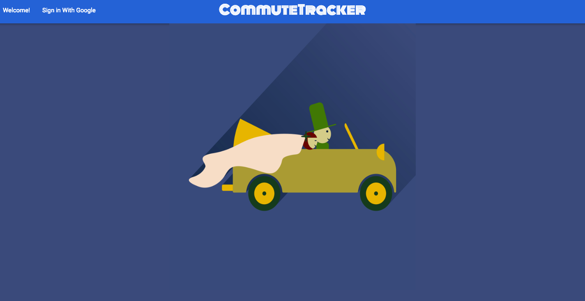
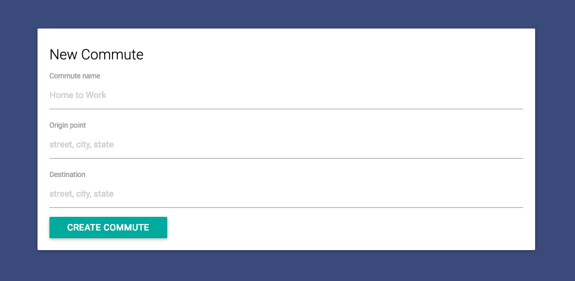
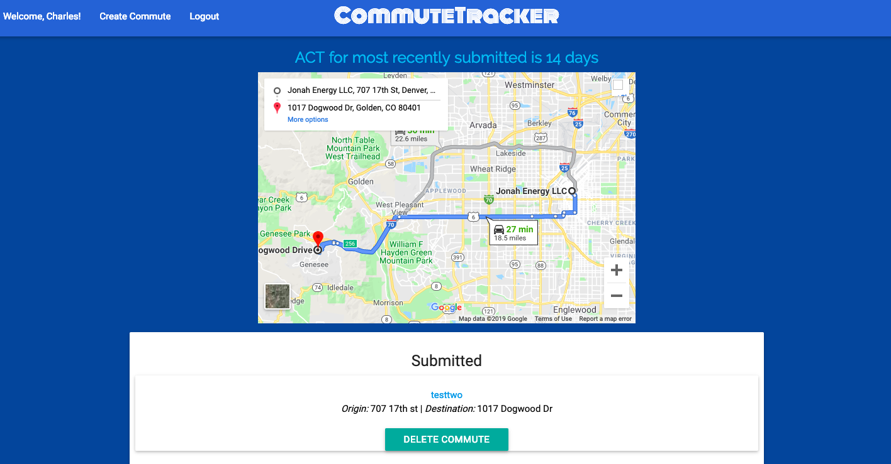
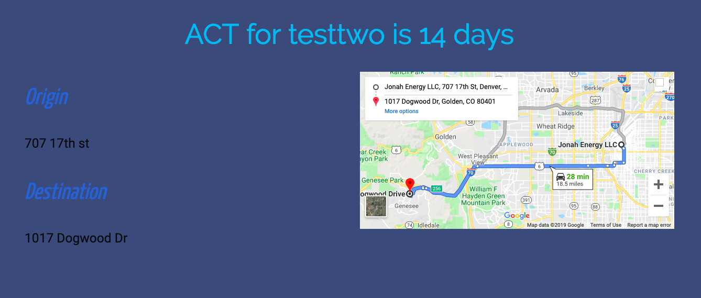

# Commute Tracker

Welcome to the Commute Tracker! This project is meant to show you your "rough" annual commute between two locations. I used to spend a lot of time driving and wanted to know the amount of time spent per year driving to school and back.

## Production

This app is hosted on Heroku. To see in production go to https://rocky-wildwood-52755.herokuapp.com/

## Local Use

1) `git clone git@github.com:cews7/commute-tracker.git`
2) `cd commute-tracker`
3) `bundle`
4) `rake db:create db:migrate db:seed db:test:prepare`
3) `rails server`
4) `localhost:3000` 

## Running Tests locally

After following `local use` steps simply run `rspec`

